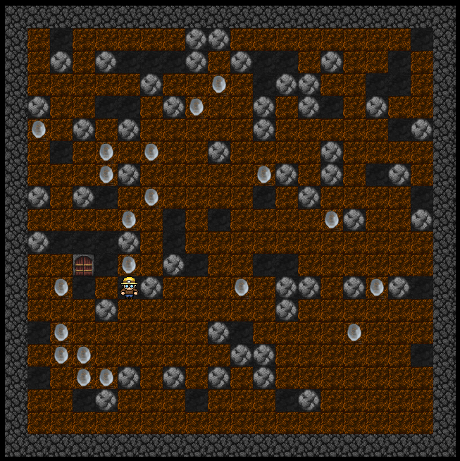
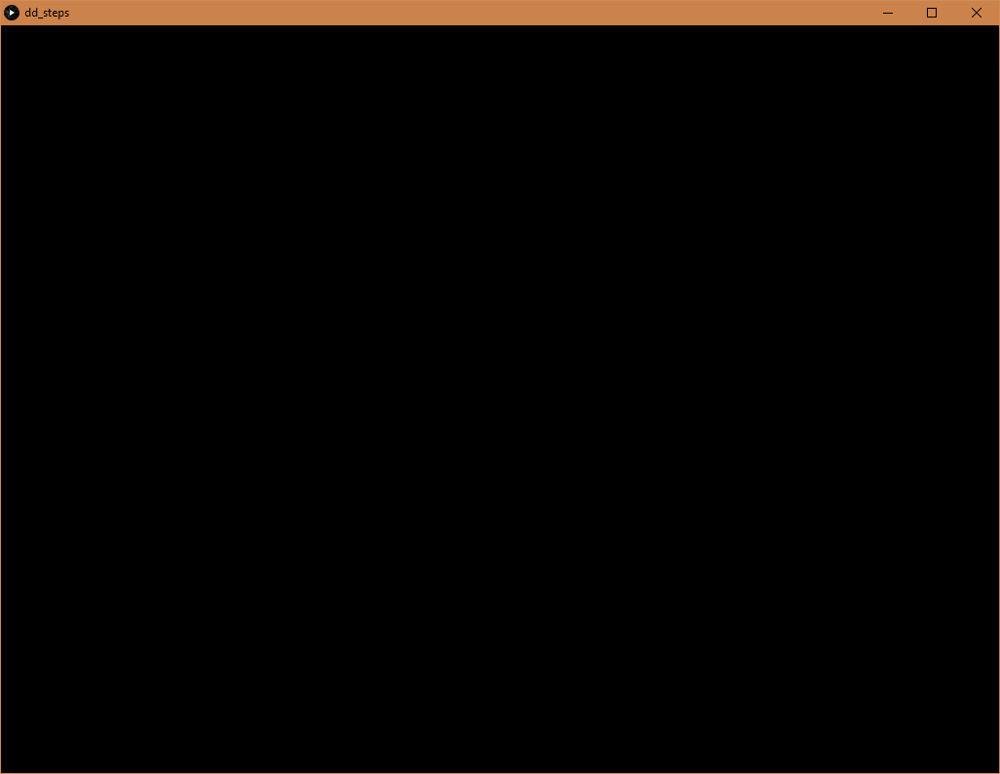
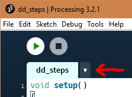
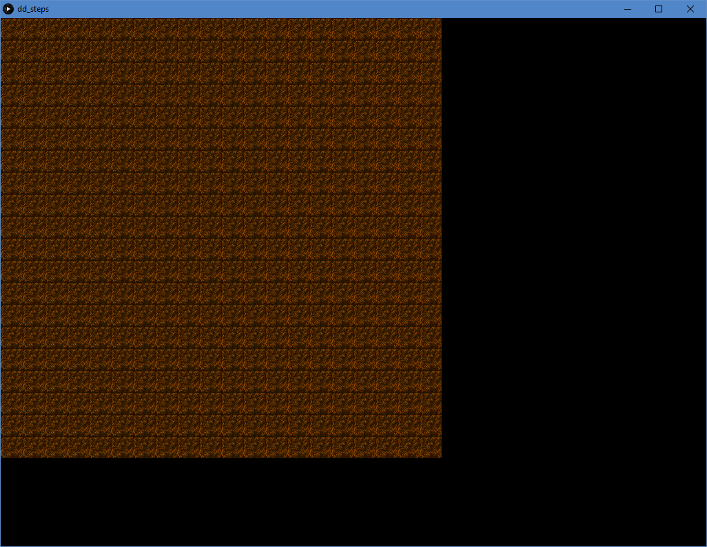
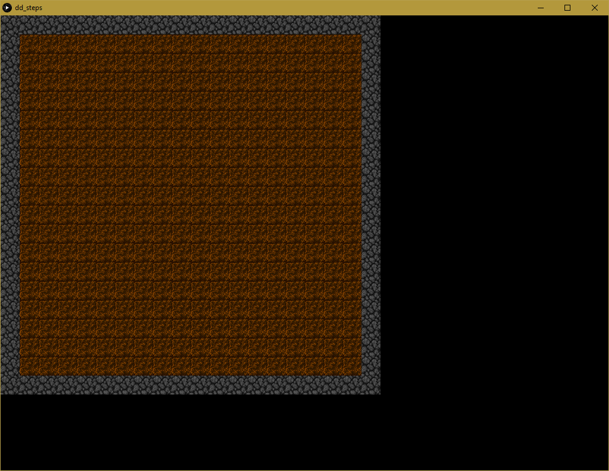
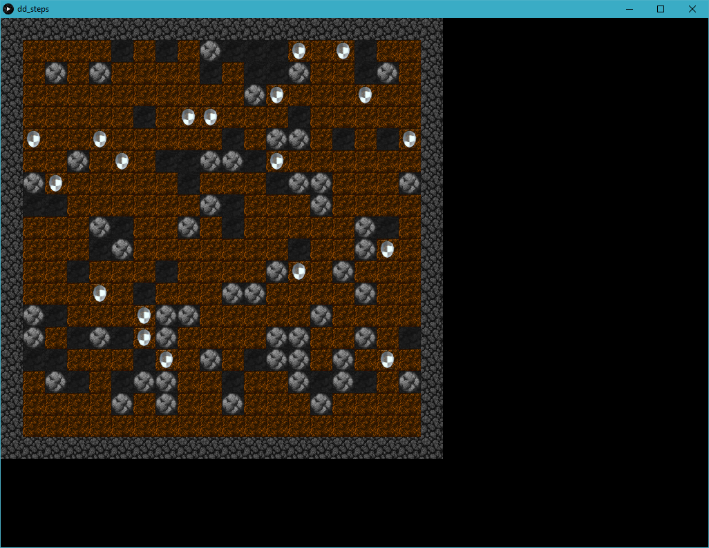

# Dangerous Dave - Del 1

Detta är första delen i en serie där vi skall implementera en "Boulder Dash" klon. I detta spel är man en gruvarbetare som skall samla diamanter i en gruva och samtidigt undvika att bli träffad av stenar som lossnar när han gräver sig fram. 

Spelplanen eller grottan består av ett rektangulärt rutnät. Varje ruta innehåller ett tal som anger vad som finns i denna ruta. För vårt vår grotta behöver vi följande rut-typer:

 * EMPTY - Inget innehåll "Luft"
 * GRAVEL - Jord som man kan gräva igenom
 * WALL - Vägg som man inte kan gräva sig igenom
 * BOULDER - Sten som kan flytta sig genom de gångar man gräver
 * PLAYER - Spelare anger att vår hjälte finns i denna ruta.
 * OUTSIDE - Anger en ruta utanför grottan.
 * DIAMOND - Diamant
 * DOOR - Dörr eller utgång.

En fylld grotta kan då se ut som bilden nedan:

# Vi börjar koda

Ladda ner mallen till spelet från CoderDojo-sidan. Mallen innehåller kod som gör det lite lättare att komma igång. Vi börjar med att skapa vårt huvudprogram.

    void setup() 
    {
        // Bestäm storleken på fönstret

        size(1024,768, P3D);
    }

    void draw()
    {
        // Rensa bakgrunden

        background(0);
    } 

Ovanstående program är inte mycket till spel. Det visar bara en tomt fönster.

# Vi skriver kod för vår grotta (Cave)

Den första delen vi skall skriva är koden för att rita upp vår grotta. För att göra det enklare att hantera vårt spel kommer denna kod ligga i en egen flik i vårt processing projekt. Detta görs genom att klicka på pilen bredvid sisat fliken i editorn:

Skapa en ny flik med namnet **Cave**. Nu visas en tom sida i editorn. 

Vi börjar med att skapa beskrivande namn på de värden vi skall lagra i rutnätet. Det blir enklare för oss på detta sätt att läsa vår kod.

    final int EMPTY = 0;
    final int GRAVEL = 1;
    final int WALL = 2;
    final int BOULDER = 3;
    final int PLAYER = 4;
    final int OUTSIDE = 5;
    final int DIAMOND = 6;
    final int DOOR = 7;

**final int** anger att vi skapar en variabel som inte kan ändras när man kör programmet. **final** betyder slutlig och anger att den inte får ändras.

I spelets mall finns en speciell mall (klass) med rutiner för att hantera grottans rutnät och uppritning, **Map**. Vi kommer att använda denna för att skriva vår egen grotta.  

För att skapa vår egen grotta bygger vi på denna mall (klass). Vi skriver in följande kod i fliken **Cave**:

    class Cave extends Map {
        
        // Rutinen nedan kallas konstruktor och anropas
        // när man skapar en Cave variabel.

        public Cave(int rows, int cols, int factor) 
        {
            // Skicka vidare grottans storlek till klassen Map
            
            super(rows, cols, factor);
        }    
    }

En klass är en mall för att skapa Cave-objekt som vi sedan använder för att rita upp vår grotta. Varje klass har en funktion med samma namn som anropas när man skapar ett Cave-objekt. 

Vi lägger till en deklaration av ett Cave-objekt i huvuprogrammet och skapar det i **setup()** funktionen.

    Cave cave;

    void setup() 
    {
        // Bestäm storleken på fönstret

        size(1024,768, P3D);
        
        cave = new Cave(20,20,1);
    }

För att rita upp vår grotta, lägger vi till ett anrop till **cave.draw()** i **draw()** funktionen i huvudprogrammet.

    void draw()
    {
        // Rensa bakgrunden

        background(0);
        
        cave.draw();
    } 

Uppritningsrutinen **draw()** ligger i klassen **Map** som vi använde för att skapa vår egen **Cave**-klass, så vi behöver inte skriva den koden själv. 

Det händer fortfarande inte så mycket i vårt fönster när man kör programmet. Detta beror på att vi inte fyllt rutnätet med innehåll. Detta skall vi göra i nästa steg:

## Fylla spelfältet

För att rita upp vårt spelfält behöver vi läsa bildfiler som finns med i den nedladdade mallen. Vi börjar med en bild för grus (gravel). Lägg till följande kod i **Cave** för att läsa in bilden **gravel.png**:

    class Cave extends Map {
        
        // Deklaration av bildvariabler
        
        PImage gravelImage;
        
        // Rutinen nedan kallas konstruktor och anropas
        // när man skapar en Cave variabel.

        public Cave(int rows, int cols) 
        {
            // Skicka vidare grottans storlek till klassen Map
            
            super(rows, cols);
            
            // Läs in bilder
            
            gravelImage = loadImage("gravel.png");
        }    
    }

För att fylla spelfältet med grus, skapar vi en funktion **createGravel()** i **Cave**-klassen. Vi kommer också använda en funktion i **Map**, **fillRect** som hjälper oss att fylla ett område i rutnätet med ett visst värde:

    void createGravel()
    {
        // fillRect(startRow, endRow, startCol, endCol, value)

        fillRect(0,nRows-1, 0, nCols-1, GRAVEL);  
    }

**nCols** och **nRows** är variabler som är definierade i **Map** och innehåller storleken på rutnätet som vi skapade objektet i huvudprogrammet. Vi anropar **createGravel()** sist i **Cave**-funktionen 

    public Cave(int rows, int cols, int factor) 
    {
        ...
        
        createGravel();
    }

För att vi skall kunna se något på skärmen måste vi också skriva en rutine **drawCell(...)** som ritar upp olika typer av rutor i rutnätet. För att rita upp en grusruta blir **drawCell(...)**

    void drawCell(int cellType, int x, int y)
    {
        if (cellType == GRAVEL)
            image(gravelImage, x, y, cellWidth * magFac, cellWidth * magFac);
    }    

**magFac** är en variabel i **Map** som anger en förstoringsfaktor för uppritningen. Denna sätts i den tredje parametern i **Cave**-anropet. 

Kör vi programmet skall ett rutnät med 20 x 20 grusfyllda rutor visas precis som i nedanstående bild:

För att det skall bli en grotta behöver vi skapa väggar längs kanterna på rutnätet. För att göra detta skriver vi en rutin, **createWalls()**. 

    void createWalls()
    {
        // Skapa vänster och höger vägg 

        for (int row=0; row<nRows; row++)
        {
            map[row][0] = WALL;
            map[row][nCols-1] = WALL;
        }

        // Skapa övre och undre vägg

        // Skriv denna själv
    }

# Uppgift 1

1. Lägg till den variabel, **gravelImage** för att lagra bilden **wall2.png**. 
1. Läs in bilden från **Cave()** funktionen.  
1. Lägg till en uppritningsfunktion för väggarna i funktionen **drawCell(...)**.
1. Lägg till ett anrop av **createWalls()** efter **createGravel()**.
1. Skriv färdigt **createWalls()** funktionen, så att den ritar upp alla väggar.

Det slutliga resultatet bör bli som i nedanstående figur:

## Skapa hålrum, stenar och diamanter

Hålrum, stenar och diamanter skall vi sätta ut slumpmässigt i grottan. Antalet av de olika sorterna bestäms av tre variabler som deklareras i **Cave**-klassen:

    class Cave extends Map {

        ...

        int nBoulders;
        int nEmpty;
        int nDiamonds;

        ...

Vi tilldelar dessa värden baserat på procentandelar av totala antalet rutor i grottan:

    public Cave(int rows, int cols, int factor) 
    {
        ...

        // Tilldela antal hålrum, stenar och diamanter 
        
        nBoulders = int(0.15*nRows*nCols);
        nEmpty = int(0.25*nRows*nCols);
        nDiamonds = int(0.05*nRows*nCols);                
        
        createGravel();
        createWalls();
    }

För att sätta ut motsvarande i rutnätet, skapar vi rutinerna, **createEmpty()**, **createBoulders()** och **createDiamonds()**. **createEmpty()**. För att göra det enklare för oss skapar vi en speciell funktion för att sätta ut block slumpmässigt, **placeRandom()**. 

    void placeRandom(int r0, int r1, int c0, int c1, int value)
    {
        // Tilldela r slumptal mellan r0 till r1
        
        int r = int(random(r0, r1));
        
        // Tilldela c slumptal mellan c0 till c1
        
        int c = int(random(c0, c1));
        
        // Tilldela rutnät värdet value
        
        map[r][c] = value;
    }             

Övriga funktioner kan sedan implementeras som **createEmpty()**-funktionen med en for-loop och anrop till **placeRandom()** enligt följande kod:

    void createEmpty()
    {
        for (int i=0; i<nBoulders; i++)
            placeRandom(1, nRows-2, 1, nCols-1, EMPTY);
    }    
   
# Uppgift 2

1. Implementera **createBoulders()** och **createDiamonds()**.
1. Anropa rutinerna i **Cave()**. Skapa diamanterna sist.
1. Deklarera variabler för bilderna **empty.png**, **boulder.png** och **diamond.png** samt lägg till inläsningsrutiner på samma sätt som för **gravel.png**
1. Lägg till uppritningsanrop i **drawCell()** för de nya rutorna.

Ett exempel på en grotta visas i följande figur:

