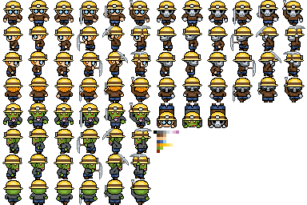

# Dangerous Dave - Del 2

I denna del skall vi lägga till funktioner för att flytta vår hjälte i labyrinten. Om ni inte hunnit med kan ni ladda ner en mall för vad vi gjorde förra gången på hemsidan.

För att hålla koll på var vår hjälte befinner sig lägger vi till 2 variabler i klassen Cave, playerRow, playerCol. 

```java
class Cave extends Map {

    ...
    
    int nBoulders;
    int nEmpty;
    int nDiamonds;
    
    int playerRow;
    int playerCol;        
    
    public Cave(int rows, int cols, int factor)

    ...
```

För att kunna rita ut vår hjälte behöver vi också ladda in en bild för honom. För detta skall vi använda en s.k. tilemap. Detta är en bild som består av många varianter av vår spelare. Tilemap:en vi skall använda här finns i bilden **player.png** i data-mappen i spelet och ser ut så här:



Vi börjar enkelt genom att läsa in bilden och kopiera översta bilden till en ny bildvariabel. Följande kod i **Cave()** gör detta:

```java
// Skapa en tom bild med 32 x 32 pixlar

playerImage = createImage(32,32,ARGB);

// Läs in hela tilemap:en

playerTileImage = loadImage("player.png");

// Kopiera 32 x 32 pixlar från övre hörnet.

playerImage.copy(playerTileImage, 0 * 32, 0 * 32, 32, 32, 0, 0, 32, 32);
```     

Nu behöver vi en funktion som placerar ut spelare någonstans i vår grotta. I Cave-klassen lägger vi till en funktion **placePlayer()**:

```java
void placePlayer()
{
    playerRow = int(random(nRows-2))+1;    
    playerCol = int(random(nCols-2))+1;
            
    map[playerRow][playerCol] = PLAYER;
    centerViewPort(playerRow, playerCol);
}  
```       

**Tänk på**: När man lägger till funktioner till vår **Cave**-klass är det viktigt att dessa hamnar mellan klassens "{" "}" precis som i följande exempel:

```java
class Cave extends Map {

    ...

    void placePlayer()
    {
        playerRow = int(random(nRows-2))+1;    
        playerCol = int(random(nCols-2))+1;
                
        map[playerRow][playerCol] = PLAYER;
        centerViewPort(playerRow, playerCol);
    }  

    ...

} 
```

För att spelare skall synas i grottan måste vi anropa funktionen från vårt huvudprogram:

```java
Cave cave;

void setup() 
{
    size(1024,768, P3D);
    
    cave = new Cave(20, 20, 1);
    cave.placePlayer();
}
```

Kör vi vårt spel nu kommer inte spelaren att visas i grottan. Detta beror på att vi inte ritar ut spelarbilden i vår uppritningsfunktion **drawCell(...)**. Lägg till följande i **drawCell(...)**:

```java
void drawCell(int cellType, int x, int y)
{
    switch(cellType)
    {
        ...

        case PLAYER:
            // Lägg till kod för att rita upp spelaren här. 
            break;
        case OUTSIDE:
            break;
    }
}
```

# Uppgift 1 

Lägg till kod för att rita upp spelaren i **drawCell(...)**. Titta på hur koden för resten av blocken är konstruerad.

# Förflytta spelaren

Vi skall nu skriva en funktion som flyttar vår spelare i grottan. I funktionen måste vi tänka på att man inte kan gå igenom stenblock eller väggar. Funktionen kallar vi **movePlayer(...)** och lägger i **Cave**-klassen:

```java
void movePlayer(int dr, int dc)
{       
    // Kontrollera att vi inte går igenom väggar eller stenar
    
    if ((map[playerRow+dr][playerCol+dc]!=WALL)&&
        (map[playerRow+dr][playerCol+dc]!=BOULDER))
    {
        // Sätt nuvarande spelposition i grottan till EMPTY
    
        map[playerRow][playerCol] = EMPTY;
        
        // placera spelaren i grottan dr, dc anger förflyttning
        
        map[playerRow+dr][playerCol+dc] = PLAYER;
        
        playerRow += dr;
        playerCol += dc;
    }
}
```

Nu har vi en funktion som kan flytta spelaren. För att kunna spela spelet måste vi anropa denna när man trycker på piltangenterna eller en handkontroll. Detta skall vi lägga till i huvudprogrammet.

I processing finns en fördefinierad variabel, **keypressed**, som anger om en tangent är nedtryckt eller inte. Det finns också en variabel, **keyCode**, som innehåller vilken specialtangent som trycktes ner. 

Lägg till följande i huvudprogrammets **draw()**-funktion:

```java
void draw()
{
    background(0);
    
    if (keyPressed)
    {
        println(keyCode);
    }

    cave.draw(); 
}
```

Vad händer när man kör programmet? Längst ner i fönstret visas olika siffror beroende på vilken tangent som trycks ner:

    37
    37
    37
    39
    39
    39
    39
    39
    39
    39
    39
    39
    39
    39
    40
    40
    40
    40
    40

Problemet är att det går för fort. Hade vi flyttat spelare så fort som dessa siffror visas hade det varit svårt att styra vår spelare. Vi måste fixa detta på något sätt. Vi skapar en speciell variabel, **keyWasReleased**, för att hålla reda på om en tangent inte längre trycks ner. Vad händer i följande kod:

```java
Cave cave;

boolean keyWasReleased;

void setup() 
{
    size(1024,768, P3D);
    
    cave = new Cave(20, 20, 1);
    cave.placePlayer();
    
    keyWasReleased = true;
}

void draw()
{
    background(0);
    
    if (keyPressed)
    {
        if (keyWasReleased)
        {
            keyWasReleased = false;
            println(keyCode);
        }
    }
    else 
        keyWasReleased = true;    
    
    cave.draw();
}  
```

Skillnaden nu är att man den bara skriver ut tangentbordskoden en gång. Precis som vi vill ha det. 

Nu skall vi lägga till kod för att flytta vår spelare. Ändra ovanstående till:

```java
void draw()
{
    background(0);
    
    if (keyPressed)
    {
        if (keyWasReleased)
        {
            keyWasReleased = false;

            switch(keyCode) 
            {
                case UP:
                    cave.movePlayer(-1,0);
                    break;                    
            }
        }
    }
    else 
        keyWasReleased = true;    
    
    cave.draw();
}  
```

Vad händer? 

# Uppgift 2

Lägg till övriga anrop för att flytta vår hjälte! Övriga piltangenter är, **DOWN**, **LEFT**, **RIGHT**.
